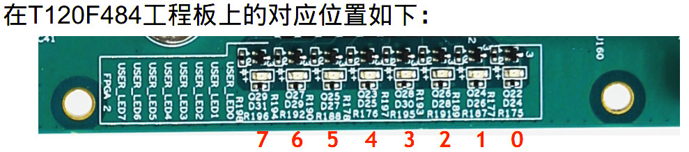

# DDR3Test
 Efinix Trion DDR3 Tester

 ```
  .--,       .--,
 ( (  \.---./  ) )
  '.__/o   o\__.'
     {=  ^  =}
      >  -  <
 __.""`-------`"".__
/                   \
\ Trion DDR3 Tester /
/                   \
\___________________/
    ___)( )(___
   (((__) (__)))

   ____   ___ ____   ___         ___ ____   ___  _  _   
  |___ \ / _ \___ \ / _ \       / _ \___ \ / _ \| || |  
    __) | | | |__) | | | |_____| | | |__) | | | | || |_
   / __/| |_| / __/| |_| |_____| |_| / __/| |_| |__   _|
  |_____|\___/_____|\___/       \___/_____|\___/   |_|  


 ```
 ## Description

 > 项目的目的：

 > Efinix Trion T35F324 ~ T120F576 有DDR3 硬核控制器， HMC， 有支持16bit和32bit两种， 本项目就是如何使用FPGA的硬核控制器以及Memory的性能评测

 - 工程使用T120F484封装， 在T20F484工程板上进行验证，可以快速移植到其他DDR3硬核的FPGA上  
 - 可选对DDR控制器的两个接口进行可配置的连续读写测试  
 - 数据与地址相关，可配置正向数据、反向数据、正向/反向交替，确保数据检查客观性  
 - 可配置DDR控制器的Burst长度和测试的Burst个数，也可以连续测试  
 - 可配置测试的DDR控制器的起始地址和结束地址，电路对设置的测试空间循环测试  
 - 对从DDR中读出的数据进行误码统计  
 - 统计每次测试操作的总周期、有效操作周期、操作效率、带宽和计时  
 - 统计读写周期（两次读写间隔），最大值、最小值和平均值  
 - 通过指示灯直观指示状态和误码状况  
 - 通过Debuger进行测试配置、控制、统计结果和状态显示、波形抓取  


 > **Efinix HMC能够支持400M，800M，1066M的DDR3L，DDR3，**


 V1.3版本发布


 功能：


 This repo focus on introduction Efinix Trion Series FPGA Hard memory controller IP support based on T120F484 Enginerr boards


 - README.md  the project readme file
 - Efinix 的官网是 www.efinixinc.com

 Efinix FPGA 的第一个低成本FPGA家族是 Trion :
 - you can register to access the documentation
 - we will provide the EVB and software for your evaluation.
 - ...


 ## Trion FPGA Family

 **FPGA lower than 1.2W for typical 120KLE logic design application**


 ## T120 FPGA summary

 Features  

 - High-density, **low-power Quantum architecture** Built on SMIC 40 nm process  
 - Low core leakage current (6.7 mA typical)  
 - FPGA interface blocks  
 ```
 FPGA interface blocks

 — GPIO
 — PLL
 — LVDS 800 Mbps per lane with up to 52 TX pairs and 52 RX pairs
 — MIPI DPHY with CSI-2 controller hard IP, 1.5 Gbps per lane
 — DDR3, DDR3L, DDR3U, LPDDR3, LPDDR2 x32 PHY (supporting x16 or x32 DQwidths) with memory controller hard IP, 25.6 Gbps aggregate bandwidth
 — Programmable high-performance I/O
 — Supports 1.8, 2.5, and 3.3 V single-ended I/O standards and interfaces• Flexible on-chip clocking
 — 16 low-skew global clock signals can be driven from off-chip external clock signals orPLL synthesized clock signals
 — PLL support• Flexible device configuration
 — Standard SPI interface (active, passive, and daisy chain)
 — JTAG interface• Fully supported by the Efinity® software, an RTL-to-bitstream compiler


 ```
 ## Software

 On Ubuntu 16LTS : Efinix provide the Free FPGA develop suit, you need register it and buy one piece of EVB

 ```sh
 ```
 Other features :

 - Efinity Version Number：2019.3.272.1.6
 - Test the project on Windows and Ubuntu16 environment both
 - 软件版本采用Efinity2019.3.272
 - 在Win10，Ubuntu16.04 都已经验证

 ## Hardware for EVB

 - 项目使用T120F484 Engieer EVB作为测试硬件环境，其中LVDS的收发端子以及LED作为DDR状态运行显示

 ## DDR3 Tester Project LED指示灯的位置

 - LED[   7] 	运行灯；FPGA正常工作，这个灯一直闪亮；
 - LED[   6] 	测试指示灯；测试过程中一直闪亮；  
 - LED[   5] 	数据错误指示；对应ILA中的TestErr；  
 - LED[   4] 	数据测试正确；对应VIO中的TestRight；  
 - LED[3 :0] 	误码计数；大于15个误码显示为全亮；  

   

 - __运行超过72个小时没有误码__
 ## Project install


 - STEP1: install Efinity 2019.3 or other advanced version in Win or Ubuntu
 - STEP2: get ready of the T120F484EVB,  
    - if you have same EVB with Efinix engieers, with the other words, it is easy to find the issue with same two boards when you need tech support.

 - STEP3: download the total repository directory into Efinity project directory, for examples, C:\Efinity\project\DDR3Test

 -- Efinity  
 -- Source  


 - STEP4: open the Efinity project with the Efinity/DdrControllerDebug.xml

 - STEP5: compiler it, then download the FPGA design hex into FPGA, it is all set

 - you can study how to use the Efinity **PLL, DDR3 HMC, GPIOs, PRBS** with the projects


 ## Project Verilog file directory

 - Efinity目录
 ```       
Efinity\DdrControllerDebug.peri.xml   	InterfaceDesigner设计文件
Efinity\DdrControllerDebug.sdc        	时钟约束文件
Efinity\DdrControllerDebug.xml        	工程文件
Efinity\debug_profile.json            		Debuger配置文件
Efinity\debug_top.v                  		Debuger顶层代码
Efinity\ParamDefine.v                		参数配置文件
```

- Source目录  
```
Source\DdrControllerDebug.v  		DDR控制器调试顶层代码
Source\DdrData.v                      		DDR数据生成和检查代码
Source\DdrTest.v                      		DDR测试控制代码
Source\DdrTestStatic.v                		DDR测试统计代码
Source\ddr_reset_sequencer.v      		DDR复位流程代码
Source\Ram2Axi4.v                     		DDR控制器Axi4控制接口代码
```
- Readme.txt						版本修改记录


 ## DDR控制器测试平台使用说明		pdf

  - [DDR控制器测试平台使用说明V1.3.pdf](.\DDR控制器测试平台使用说明V1.3.pdf)

 ## Update

 - Feb-1-2020,  migrate from 1.2 to 1.3 and certified by Richard Zhu

  Tester by Ben Chen in Windows, test in T120F484 Eng board

  Compiler by Wisdom Zhang in Ubuntu16


 ## Acknowledge

 The code constributor are major from Richard Zhu

 Project upload by Wisdom Zhang

 Anything question: email: 909614802 at qq dot com
 ```
  _____  __ _       _      
 | ____|/ _(_)_ __ (_)_  __
 |  _| | |_| | '_ \| \ \/ /
 | |___|  _| | | | | |>  <
 |_____|_| |_|_| |_|_/_/\_\
 ```
